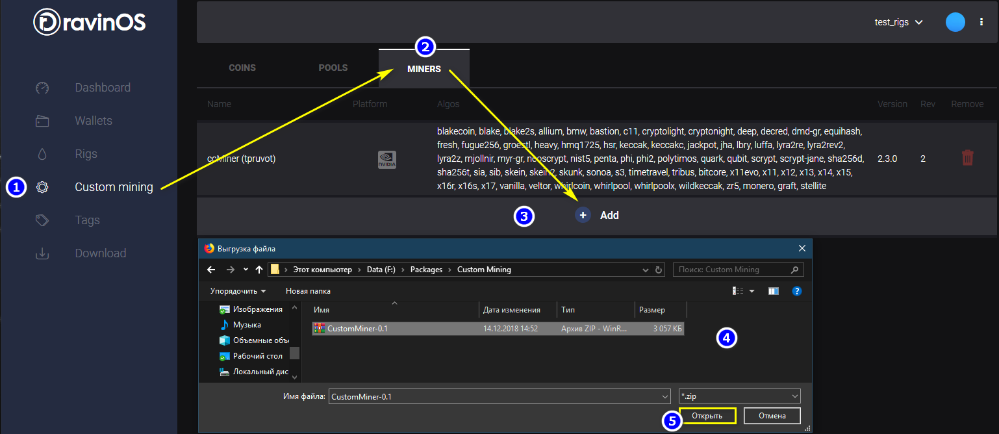
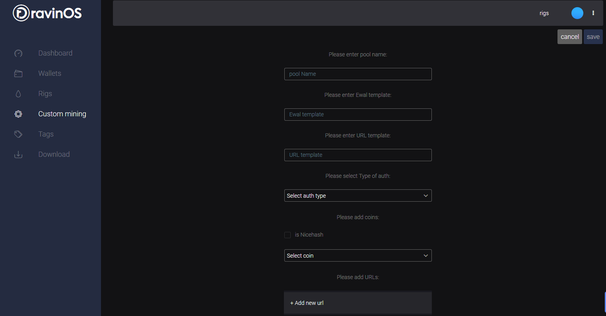
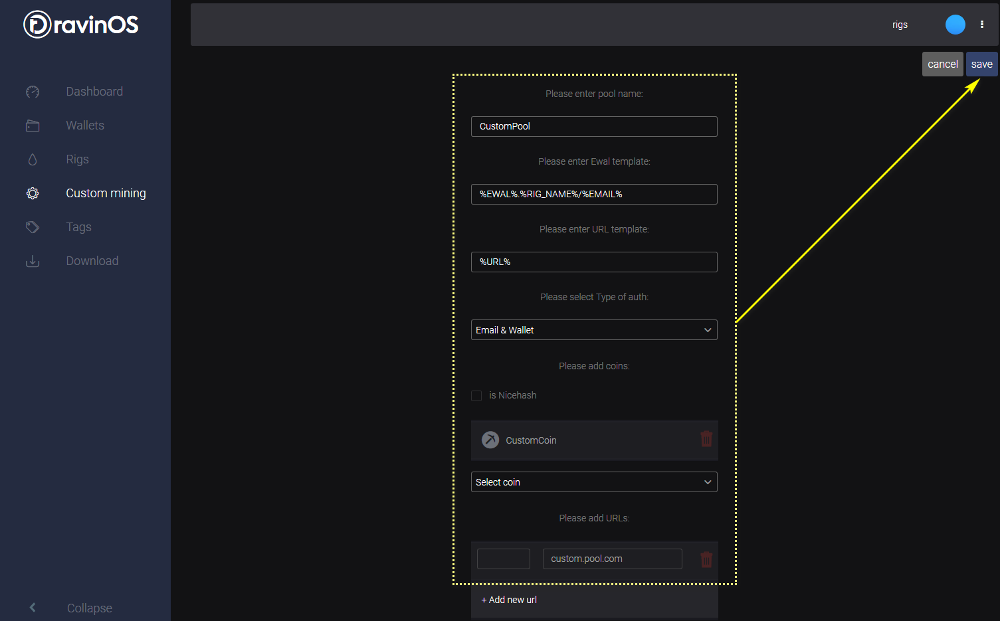

Использование Custom mining в RavinOS.

Система *RavinOS* позволяет использовать сторонние алгоритмы для майнинга и
добычи кастомных монет. Для использования фунционала Custom Mining пользователю
необходимы:

1.  ZIP архив с майнером, включающий в себя:

-   файлы майнера

-   каталог **RAVINOS** c файлом конфигурации пакета майнера **manifest.json** и
    двумя файлами скрипта на языке **python** (**start.py** и **stats.py**).
    Структура файлов подробнее – в соответствующем разделе.

1.  Данные монеты: алгоритм и тип

2.  Данные пула:

-   Шаблон адреса пула

-   Тип авторизации на пуле

-   Данные для авторизации на пуле (адрес, Порт, Кошелек, имя пользователя,
    пароль и т д.)

Добавление Custom Miner
=======================

Файлы каталога RAVINOS
----------------------

### Файл конфигурации пакета майнера **manifest.json**

{  
"package":"", // Имя пакета (должно совпадать с именем ZIP архива)  
"name": "", // Название майнера  
"version": "", // Версия майнера  
"description": "", // Описание пакета  
"maintainer":"", // Информация о создателе пакета  
"platforms": ["",…,""], // Поддерживаемые платформы  
"dual_coin": **bool**, // Поддержка второй монеты  
"algo": ["",…,""], // Поддерживаемые алгоритмы  
"executable": [""], // Наименование исполняемого файла  
"rev":int // Версия пакета  
}

Скрипт запуска **start.py**
---------------------------

import ravinos

cfg = ravinos.get_config()  
...

YOUR CODE HERE

...  
ravinos.run(command\_ line)

**ravinos.get_config** функция возвращает объект конфигурации задачи для
майнера, на основании указанных в системе параметров.

{

‘coins’: [ // Массив монет (index=0 - Primary, index=1 - Secondary (если есть)

‘coin_id’ : int,

‘pools’: [

‘url’: string, // Адрес пула

‘user’: string, // Имя пользователя

‘password’: string, // Пароль пула

‘pool_type’: int, // Тип пула 0= Default, 1=Nicehash

>   ]

>   ‘algo’: string,

],

‘work_dir’: string, // Текущая рабочая директория

‘miner_dir’: string, // Директория майнера

‘args’: string, // Дополнительные аргументы командной строки

‘api_port’: uint32, // Доступный порт для API майнера

‘log_file’:string, // Путь к лог-файлу

‘mpus’: [ // Массив MPU (miner process unit)

‘id’:int32 , // Порядковый номер MPU по шине PCI (начинается с 0)

‘id_by_type’:int32, // Порядковый номер по типу устройства (AMD, NVIDIA)
(начинается с 0)

>   ‘openl_id’:int32, // Порядковый номер по OpenCL (начинается с 0)

‘opencl_id_by_platform’:int32, // Порядковый номер по платформе OpenCL (AMD,
NVIDIA) (начинается с 0)

‘pci_id’:int32, // BUS ID

‘pci’: string, // BUS ID (строка) 01:00.0

‘type’:string, // Тип MPU (AMD, NVIDIA)

‘name’:string, // Название MPU

‘memory’:string, // Тип чипа памяти MPU (AMD)

‘memory_size’:int64, // Доступный размер памяти MPU

],

‘platform’:string, //

‘user_config,omitempty’:string, // Контент пользовательского файла конфигурации

‘intensity,omitempty’:string, // Интенсивность (указывается согласно настройкам
майнера)

}

**ravinos.run** запускает сформированную пользователем строку на исполнение

### Скрипт получения статистики **stats.py**

Пример получения статистики raw socket **ro.get_socket_data** или web
**ro.get_http_data**:

import ravinos  
  
stats = ro.get_stats()  
  
ravinos.get_socket_data(stats[‘api_port’], ‘some_command’)

*or*

ravinos.get_http_data(‘url’)

...

YOUR CODE HERE

...  
  
ravinos.set_stats(stats)

**ravinos.get_stats** функция получает объект статистики, который необходимо
вернуть в функцию **ravinos.set_stats**:

{

"mpu":[

‘id’:int32 , // Порядковый номер MPU по шине PCI (начинается с 0)

‘id_by_type’:int32, // Порядковый номер по типу устройства (AMD, NVIDIA)
(начинается с 0)

>   ‘openl_id’:int32, // Порядковый номер по OpenCL (начинается с 0)

‘opencl_id_by_platform’:int32, // Порядковый номер по платформе OpenCL (AMD,
NVIDIA) (начинается с 0)

‘pci_id’:int32, // BUS ID

‘pci’: string, // BUS ID (строка) 01:00.0

‘type’:string, // Тип MPU (AMD, NVIDIA)

"hash_rate1":float64, // хешрейт первой монеты

"hash_rate2":float64, // хешрейт второй монеты (если есть)

"temp,omitempty":int32,

]

"fans,omitempty":[

>   "percent":int32,

"rpm":int32,

]

"errors":[]string, // массив ошибок

"log_file":string , //

"last_log_file_size":int64, //

"have_driver_error":bool, //

"api_port":uint32, // Доступный порт для API майнера

}

**ravinos.get_socket_data** функция позволяет получить данные напрямую из сокета
(в формате майнера). Принимает 2 параметра: порт API и команда для получения
статистики (в формате майнера).

**ravinos.get_http_data** функция позволяет получить данные по http протоколу (в
формате майнера). Принимает 1 параметр: URL статистики.

**ravinos.set_stats** функция принимает, сформированный кодом пользователя,
объект статистики и передает его в систему.

Формирование ZIP архива
-----------------------

Формирование ZIP архива доступно любыми удобными пользователю средствами.
Структура архива:

/*miner_dir*

>   /RAVINOS

/manifest.json

/start.py

/stats.py

/*miner_files*

Интеграция Custom miner архива в систему RavinOS
------------------------------------------------

После того как архив сформирован и все необходимые данные известны можно
переходит к непосредственному добавлению майнера в систему RavinOS. Для этого
необходимо:

1.  В меню слева выбрать пункт **Custom mining**

2.  Перейти на вкладку **MINERS**

3.  Нажать **Add**

4.  В открывшемся окне проводника выбрать ранее сформированный **zip** архив

5.  Нажать **Открыть**

1.  Подтвердить добавление архива

    

Если все сделано верно, то новый добавленный майнер отобразится в списке на
текущей вкладке.

Добавление Custom Coin
======================

Для добавления Custom Coin (кастомной монеты):

1.  В меню слева выбрать пункт **Custom mining**

2.  Перейти на вкладку **COINS**

3.  Нажать **Add**

1.  В открывшейся форме заполнить данные:

    -   Coin Name // наименование монеты

    -   Short Name // сокращение имени монеты

    -   Select algo // выбор алгоритма монеты

    -   Is Nicehash // флаг для Nicehash монет

1.  Нажать **Save** (станет активной после заполнения формы)

Если все сделано верно, то новая монета отобразится в списке на текущей вкладке.

Добавление Custom Pool
======================

Для добавления Custom Pool (кастомного пула):

1.  В меню слева выбрать пункт **Custom mining**

2.  Перейти на вкладку **POOLS**

3.  Нажать **Add**

1.  В открывшейся форме заполнить данные:

    -   pool Name // наименование пула

    -   Ewal template // шаблон кошелька

    -   URL template // шаблон URL

    -   Select auth type // выбор типа авторизации на пуле

    -   Is Nicehash // указание типа сервера nicehash

    -   Select coin // выбор монет(ы)

    -   Add new url // добавление URL

1.  Нажать **Save** (станет активной после заполнения формы)

Если все сделано верно, то новый пул отобразится в списке на текущей вкладке.

