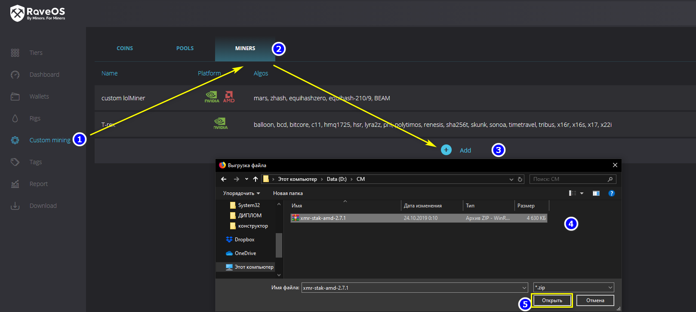
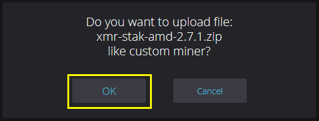
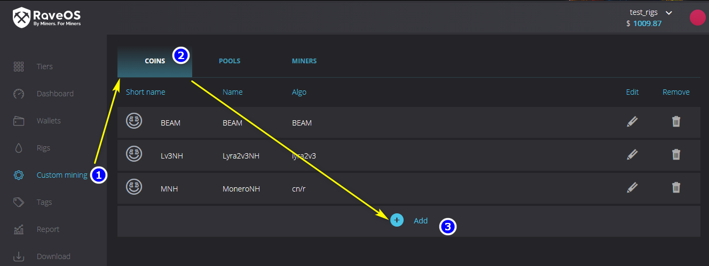
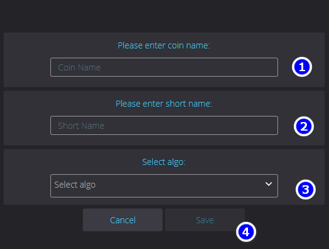
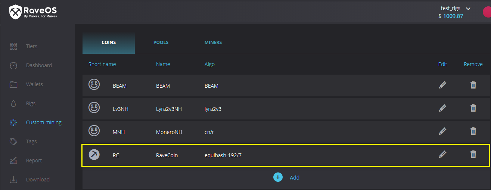
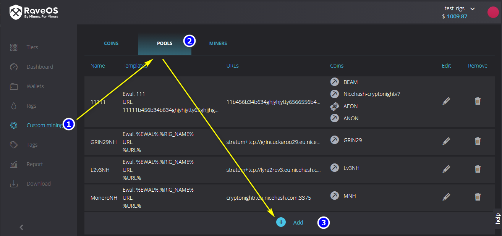
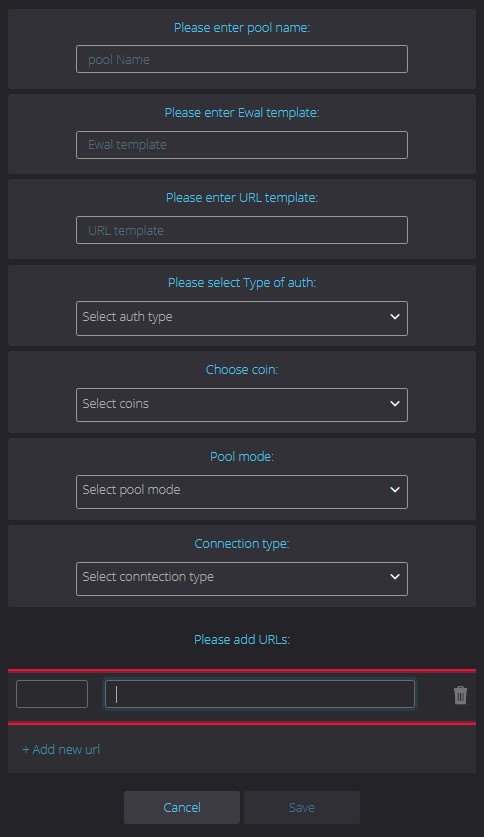
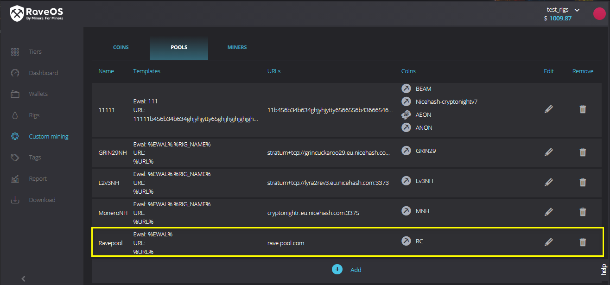

## Custom mining in RaveOS.

The *RaveOS* allows you to use third-party algorithms for mining custom coins. Custom Mining requires:

1.  ZIP archive with miner, including:
    
    - miner files
    - directory **RAVINOS** in which the configuration file of the miner package **manifest.json** and two other scripts 
    in **python** (**start.py** and **stats.py**). 
       
    The structure of the files in detail is described below in the appropriate section.

2.  Coin info: algorithm and name

3.  Pool data:

    - Pool name
    - Wallet template
    - URL template
    - Pool authorization type
    - Data for authorization on the pool (address, port, wallet, username, password, and so on.)
        
How to add custom miner
=======================

RAVINOS directory files description
----------------------

### Miner package configuration file **manifest.json**

```json
{
  "package":"nbminer-21.0",
  "name": "NBMiner",
  "version": "21.0",
  "description": "NBMiner 21.0",
  "maintainer":"RavinOS (dev@ravinos.com)",
  "platforms": ["nvidia"],
  "dual_coin": false,
  "algo": ["cuckaroo29", "ethash", "daggerhashimoto", "tensority", "cuckaroo31", "cuckoo"],
  "executable": ["nbminer"],
  "rev":1
}
```
Description of configuration options:
```GO
{  
    "package":"",           // Package name (same as ZIP archive name)  
    "name": "",             // Miner name  
    "version": "",          // Miner version  
    "description": "",      // Package description  
    "maintainer":"",        // developer info  
    "platforms": ["",…,""], // Platforms miner can work with (AMD, NVIDIA)  
    "dual_coin": bool,      // Support of the second coin  
    "algo": ["",…,""],      // Supported algorithms  
    "executable": [""],     // The name of the executable file  
    "rev":int               // Package version  
}
```

### The startup script **start.py**

```python
import ravinos
cfg = ravinos.get_config()  
...
YOUR CODE HERE
...  
ravinos.run(commandline)
```

**ravinos.get_config** the function returns a task configuration object for miner, based on the parameters specified in the system.
```GO
{
  "auth_config": {                  // Contains authorization data for the pool
  	"login": string,                // Pool login
	"ewal": string,                 // Wallet info
	"worker": string,               // Worker name
	"email": string,                // Email
	"pass":	string,                 // Pool password 
	}
  "coins": [                        // An array of coins (index=0 - Primary, index=1 - Secondary
      "coin_id" : int,              // Coin db id
      "pools": [                    // An array of pools
          "url": string,            // Pool address
          "user": string,           // User name
          "password": string,       // The pool password
          "pool_type": int,         // The type of a pool
      ],
      "wallet id": int,             // Wallet db id
      "algo": string,               // The algorithm of the coin
      "coin_id": ing,               // Coin db id
      "name": string,               // Coin short name
  ],
  "work_dir": string,               // Current working directory
  "miner_dir": string,              // Directory of miner
  "args": string,                   // Additional command line arguments
  "api_port": uint32,               // Available port for miner API
  "log_file":string,                // The path to the log file
  "mpus": [                         // An array of MPU (miner process unit)
      "id":int32,                   // The sequence number of the MPU by the PCI bus
      "id_by_type":int32,           // Serial number by device type (AMD, NVIDIA)
      "openl_id":int32,             // OpenCL sequence number
      "pci_id":int32,               // BUS ID
      "pci": string,                // BUS ID (строка) 01:00.0
      "type":string,                // MPU type (AMD, NVIDIA)
      "name":string,                // MPU name
      "memory":string,              // The type of memory chip MPU (AMD)
      "memory_size":int64,          // Available memory size MPU
  ],
  "platform":string,                //
  "user_config":string,             // The content of a custom configuration file
  "intensity":string,               // Intensity (specified according to miner settings)
}
```
*All sequence numbers start with 0

**ravinos.run** returns the generated string to the program

### Script to get statistics **stats.py**

Example of getting statistics *raw socket* **ravinos.get_socket_data** or *web*
**ravinos.get_http_data**:

```python
import ravinos  
stats = ravinos.get_stats()  
ravinos.get_socket_data(stats[‘api_port’], ‘some_command’)
...
YOUR CODE HERE
...  
ravinos.set_stats(stats)
```
*OR*
```python
import ravinos  
stats = ravinos.get_stats()  
ravinos.get_http_data(url)
...
YOUR CODE HERE
...  
ravinos.set_stats(stats)
```
**ravinos.get_stats** the function gets the statistics object to pass to the function **ravinos.set_stats**:
```GO
{
    "mpu":[
        "id":int32,                     // The sequence number of the MPU by PCI bus*
        "id_by_type":int32,             // Serial number by device type (AMD, NVIDIA)*
        "openl_id":int32,               // OpenCL sequence number*
        "pci_id":int32,                 // BUS ID
        "pci": string,                  // BUS ID (строка) 01:00.0
        "type":string,                  // MPU type (AMD, NVIDIA)
        "hash_rate1":float64,           // hashrate of the first coin
        "hash_rate2":float64,           // hashrate of the second coin (if exist)
        "temp":int32,
        "shares": {                     // shares produced (by MPU)
        	"accepted": int,            // accepted shares
        	"invalid": int,             // invalid shares
        	"rejected": int,            // rejected shares
        }
    ]
    "fans":[
        "percent":int32,
        "rpm":int32,
    ]
    "shares": {                     // shares produced (by task)
        "accepted": int,            // accepted shares
        "invalid": int,             // accepted shares
        "rejected": int,            // rejected shares        
    }
    "errors":[]string,                  // array contains errors
    "log_file":string,                  // path to miner log file
    "last_log_file_size":int64,         // The last known size of the miner log file 
    "have_driver_error":bool,           // Driver error flag
    "api_port":uint32,                  // Available port for miner API          
}
```
*All sequence numbers start with 0

**ravinos.get_socket_data** the function allows you to get data directly from the socket. 
Takes 2 parameters: API port and command to get statistics (format depends on the miner).

**ravinos.get_http_data** the function allows you to receive data via http. 
Takes 1 parameter: statistics URL.

**ravinos.set_stats** the function takes the statistics object generated by the user code and passes it to the system.

Formation of ZIP archive
-----------------------

Formation of ZIP archive is available by any means convenient to the user.

The archive structure:

    /RAVINOS

        /manifest.json

        /start.py

        /stats.py

    /*miner_files*

Integration of the Custom miner archive into the *RaveOS*
------------------------------------------------

Once the archive is formed and all the necessary data is known you can proceed to the addition of the miner to the *RaveOS*. 

1.  Select **Custom mining** from the left menu

2.  Go to the **MINERS** tab

3.  Click **Add**

4.  In the Explorer window select the previously formed **zip** archive

5.  Click **Open**
    

6.  Confirm archive addition
    

If everything is done correctly, the newly added miner will appear in the list on the current tab.


How to add custom coin
======================

For adding custom coin:

1.  Select **Custom mining** from the left menu

2.  Go to the **COINS** tab

3.  Click  **Add**

    

4. In the form that opens, fill in the data:
    ```
    -   Coin Name       // Coin name
    -   Short Name      // Coin short name
    -   Select algo     // Choose coin algo
    ```
5. Click **Save** (will become active after filling out the form)
    

If done correctly, the new coin will appear in the list on the current tab.



How to add custom pool
======================

To add a custom pool:

1.  Select **Custom mining** from the left menu

2.  Go to the **POOLS** tab

3.  Click **Add**

    

4.  In the form that opens, fill in the data:

    ```
        -   pool Name           // Pool name
        -   Ewal template       // wallet template
        -   URL template        // URL template
        -   Select auth type    // select the authorization type on the pool
        -   Choose coin         // choose coin
        -   Pool mode           // choose pool mode
        -   Connection type     // choose pool connection type
        -   Add new url         // Adding URL
    ```
    

5.  Click **Save** (will become active after filling out the form)
     
If done correctly, the new pool will appear in the list on the current tab.



An additional set of functions (\_init_\.py)
=======================

The following features in the *ravinos* module are provided for user convenience

**ravinos.get_by_type**(devs, type) 

Takes a list of devices and type. type can take values (AMD, NVIDIA, MIXED).

Returns an array of the GPU of the selected type. When specified MIXED - sorts the returned array.

**ravinos.sort_devs**(devs, sort_by) 

Accepts a list of devices and a sorting method.

Returns a sorted array of devices.

**ravinos.get_pool_type**(val)

Takes a numeric value. The parameter contains data about the type of pool and the presence of encryption and its type.

Parses the value of the bitwise. Where the first 4 bits define the connection scheme, 
and the second 4 the mode of operation of the pool.

Constants for connection scheme definition:
```
   STRATUM_PROTO_TYPE_TCP   = 0x1
   STRATUM_PROTO_TYPE_SSL   = 0x2
   STRATUM_PROTO_TYPE_HTTP  = 0x4
   STRATUM_PROTO_TYPE_TLS   = 0x8
   
   STRATUM_MODE_ETH_PROXY   = 0x10
   STRATUM_MODE_QTMINER     = 0x20
   STRATUM_MODE_MINER_PROXY = 0x40
   STRATUM_MODE_NICEHASH    = 0x80
```

**ravinos.url_parse**(url)

Accepts the pool URL. If necessary, adds a scheme for further correct parsing the address into components.

Parses the address and returns 6 URL components as a standard function **urlparse**

**ravinos.info**(text)

Writes the specified text to the log file

**ravinos.error**(text)

Writes the error text to the log file and finishes the script execution

**ravinos.get_by_type**(dev, type)

Selects cards according to the type

**ravinos.sort_devs**(devs, key)

Sorts devices by the field specified in the key
